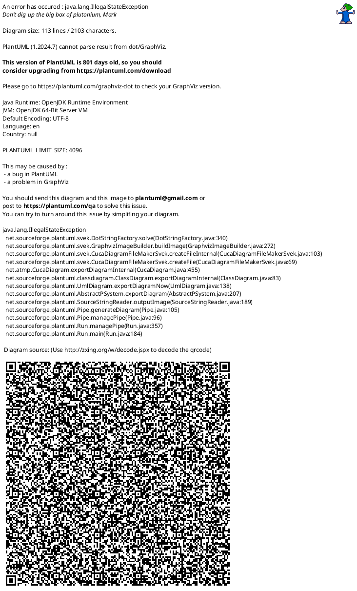

# Diagrama de Classes — Sistema de Aluguel de Carros

> Arquivo fonte: [`/docs/diagramas/diagrama-classes.puml`](diagramas/diagrama-classes.puml)

```plantuml
@startuml diagrama-classes
skinparam classAttributeIconSize 0
skinparam linetype ortho

' ─── Enums ───────────────────────────────────────────────
enum TipoAgente {
  EMPRESA
  BANCO
}

enum StatusPedido {
  EM_ANALISE
  APROVADO
  REPROVADO
  CANCELADO
  CONTRATADO
}

enum TipoProprietario {
  CLIENTE
  EMPRESA
  BANCO
}

' ─── Usuário / Autenticação ──────────────────────────────
class Usuario {
  - id : Long
  - login : String
  - senha : String
  - role : String
}

class Cliente {
  - id : Long
  - rg : String
  - cpf : String
  - nome : String
  - endereco : String
  - profissao : String
}

class Rendimento {
  - id : Long
  - entidadeEmpregadora : String
  - valor : BigDecimal
}

class Agente {
  - id : Long
  - razaoSocial : String
  - cnpj : String
  - tipo : TipoAgente
}

' ─── Automóvel ───────────────────────────────────────────
class Automovel {
  - id : Long
  - matricula : String
  - ano : Integer
  - marca : String
  - modelo : String
  - placa : String
  - tipoProprietario : TipoProprietario
}

' ─── Pedido e Contratos ──────────────────────────────────
class PedidoAluguel {
  - id : Long
  - dataInicioPretendida : LocalDate
  - dataFimPretendida : LocalDate
  - status : StatusPedido
  - criadoEm : LocalDateTime
  - atualizadoEm : LocalDateTime
  - observacoes : String
}

class ContratoAluguel {
  - id : Long
  - dataInicio : LocalDate
  - dataFim : LocalDate
  - valorTotal : BigDecimal
  - assinadoEm : LocalDateTime
}

class ContratoCredito {
  - id : Long
  - valorFinanciado : BigDecimal
  - taxaJuros : BigDecimal
  - numeroParcelas : Integer
  - emitidoEm : LocalDateTime
}

' ─── Relacionamentos ─────────────────────────────────────

Usuario "1" -- "1" Cliente : autentica >
Usuario "1" -- "1" Agente  : autentica >

Cliente "1" *-- "1..3" Rendimento : possui >

Cliente "1" -- "0..*" PedidoAluguel   : solicita >
Agente  "1" -- "0..*" PedidoAluguel   : avalia >

PedidoAluguel "1" -- "1"    Automovel      : refere-se a >
PedidoAluguel "1" -- "0..1" ContratoAluguel : origina >

ContratoAluguel "1" -- "1"    Automovel     : formaliza >
ContratoAluguel "1" -- "0..1" ContratoCredito : possui >

Agente "1" -- "0..*" ContratoCredito : concede >

Automovel "0..*" -- "0..1" Cliente : proprietário >
Automovel "0..*" -- "0..1" Agente  : proprietário >

PedidoAluguel --> StatusPedido
Agente        --> TipoAgente
Automovel     --> TipoProprietario

@enduml
```
