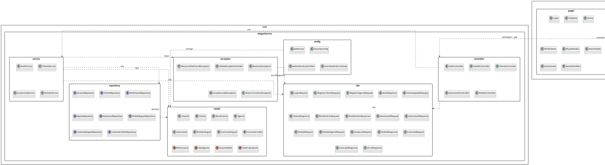

# Diagrama de Pacotes — Sistema de Aluguel de Carros

> Arquivo fonte: [`/docs/diagramas/diagrama-pacotes.puml`](diagramas/diagrama-pacotes.puml)

```plantuml
@startuml diagrama-pacotes
skinparam packageStyle rectangle
skinparam linetype ortho

' ─── Backend ─────────────────────────────────────────────
package "com.aluguelcarros" {

  package "config" {
    class SecurityConfig
    class JwtService
    class JwtAuthenticationFilter
    class UserDetailsServiceImpl
  }

  package "exception" {
    class GlobalExceptionHandler
    class BusinessException
    class ResourceNotFoundException
    class UnauthorizedException
    class StatusTransitionException
  }

  package "model" {
    class Usuario
    class Cliente
    class Rendimento
    class Agente
    class Automovel
    class PedidoAluguel
    class ContratoAluguel
    class ContratoCredito
    enum RoleUsuario
    enum TipoAgente
    enum StatusPedido
    enum TipoProprietario
  }

  package "dto" {
    class LoginRequest
    class RegisterClienteRequest
    class RegisterAgenteRequest
    class AuthResponse
    class ClienteUpdateRequest
    class ClienteResponse
    class RendimentoRequest
    class RendimentoResponse
    class AutomovelRequest
    class AutomovelResponse
    class PedidoRequest
    class PedidoAgenteRequest
    class AvaliacaoRequest
    class PedidoResponse
    class ContratoRequest
    class ContratoResponse
    class ErrorResponse
  }

  package "repository" {
    interface UsuarioRepository
    interface ClienteRepository
    interface RendimentoRepository
    interface AgenteRepository
    interface AutomovelRepository
    interface PedidoAluguelRepository
    interface ContratoAluguelRepository
    interface ContratoCreditoRepository
  }

  package "service" {
    class AuthService
    class ClienteService
    class AutomovelService
    class PedidoService
  }

  package "controller" {
    class AuthController
    class HealthController
    class ClienteController
    class AutomovelController
    class PedidoController
  }

}

' ─── Frontend ────────────────────────────────────────────
package "frontend (React + Vite)" {

  package "services" {
    class api
    class clienteService
    class pedidoService
  }

  package "context" {
    class AuthContext
  }

  package "components" {
    class Navbar
    class PrivateRoute
    class StatusBadge
    class Modal
  }

  package "pages" {
    class Login
    class Cadastro
    class Home
    class PerfilCliente
    class MeusPedidos
    class NovoPedido
    class Automoveis
    class AnalisePedidos
  }

}

' ─── Dependências Backend ────────────────────────────────
controller  ..> service    : usa
controller  ..> dto        : usa
service     ..> repository : usa
service     ..> model      : usa
service     ..> dto        : usa
service     ..> exception  : lança
repository  ..> model      : persiste
config      ..> model      : carrega
exception   ..> dto        : ErrorResponse

' ─── Dependências Frontend ───────────────────────────────
pages      ..> components : renderiza
pages      ..> services   : consome
pages      ..> context    : useAuth
components ..> context    : useAuth

' ─── Integração ──────────────────────────────────────────
services ..> controller : "HTTP/REST + JWT"

@enduml
```
